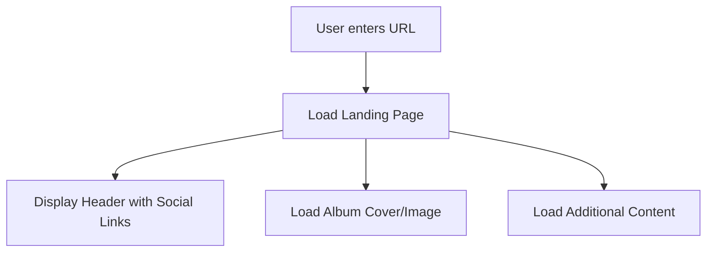
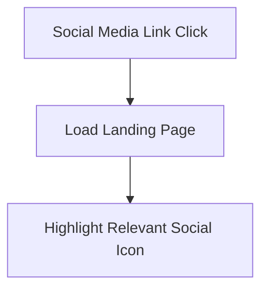
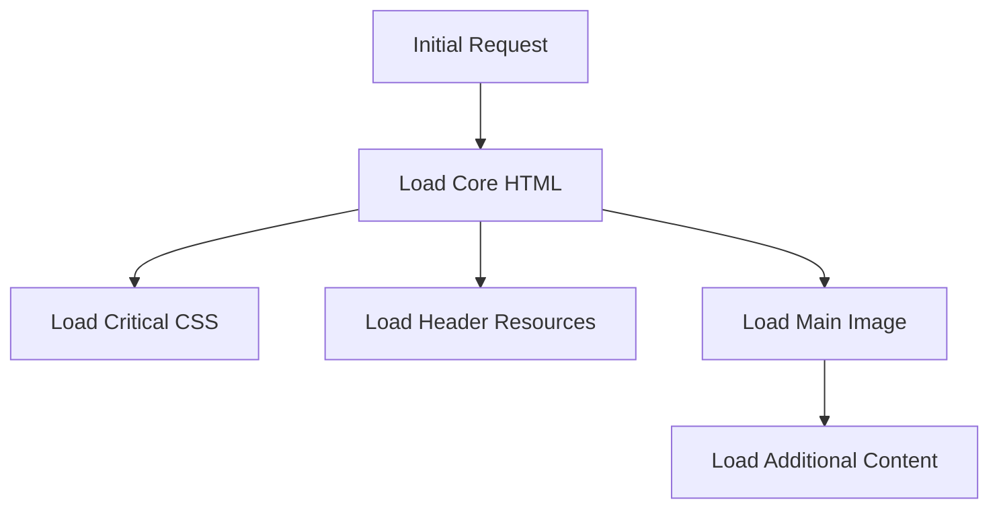
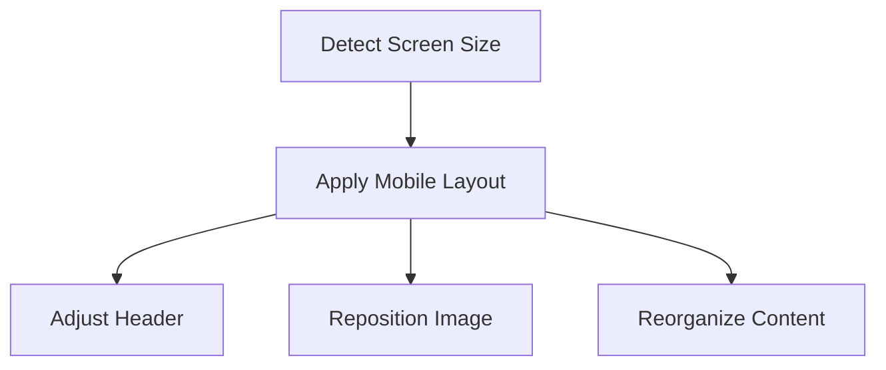

# App Flow Document: Portfolio Website

## Overview
This document outlines the user interaction flows and navigation paths within the portfolio website. It details how users move through the site, interact with different elements, and the expected system responses.

## 1. Entry Points

### 1.1 Direct URL Access

### 1.2 Social Media Referrals

## 2. User Interactions

### 2.1 Header Navigation
- **Social Media Icons**
  1. User hovers over icon
     - Display tooltip with platform name
     - Show hover state animation
  2. User clicks icon
     - Open platform in new tab
     - Maintain current page state

- **Title/Logo**
  1. User clicks title
     - Return to default landing page state
     - Reset any active states

### 2.2 Content Interactions
- **Album Cover/Image**
  1. User hovers over image
     - Show subtle hover effect
     - Display any relevant overlay information
  2. User clicks image
     - Potential expansion for full view
     - Show additional details if applicable

### 2.3 Additional Content Area
- **Content Blocks**
  1. User scrolls through content
     - Smooth scroll behavior
     - Lazy load content as needed
  2. User interacts with elements
     - Handle click events
     - Show relevant feedback

## 3. Performance Flows

### 3.1 Initial Load
1. Load critical CSS
2. Load header elements
3. Load hero image/album cover
4. Load remaining content
5. Initialize interactive elements

### 3.2 Resource Loading

## 4. Error Handling

### 4.1 Loading Errors
- Image load failure
  1. Display placeholder
  2. Retry load once
  3. Show fallback if retry fails

- Social media icon load failure
  1. Show fallback icon
  2. Maintain click functionality

### 4.2 Connection Issues
- Slow connection
  1. Show loading indicators
  2. Prioritize critical content
  3. Load non-essential elements last

## 5. State Management

### 5.1 Page States
- Initial Load State
- Content Loading State
- Error State
- Interactive State

### 5.2 Component States
- Default
- Hover
- Active
- Loading
- Error

## 6. Analytics Flow
1. Page load tracking
2. Social link click tracking
3. Content interaction tracking
4. Error tracking

## 7. Mobile Considerations

### 7.1 Responsive Behavior

### 7.2 Touch Interactions
- Replace hover states with touch events
- Implement mobile-friendly navigation
- Ensure adequate touch targets

## 8. Performance Metrics

### 8.1 Load Time Targets
- First Contentful Paint: < 1.5s
- Time to Interactive: < 3s
- Full Page Load: < 4s

### 8.2 Interaction Metrics
- Icon hover response: < 100ms
- Click response: < 100ms
- Page transition: < 300ms

## 9. Future Flow Considerations

### 9.1 Potential Additions
- Dark mode toggle flow
- Language selection flow
- Content filter flow
- Search functionality flow

### 9.2 Optimization Opportunities
- Preload critical assets
- Implement progressive loading
- Cache frequently accessed content